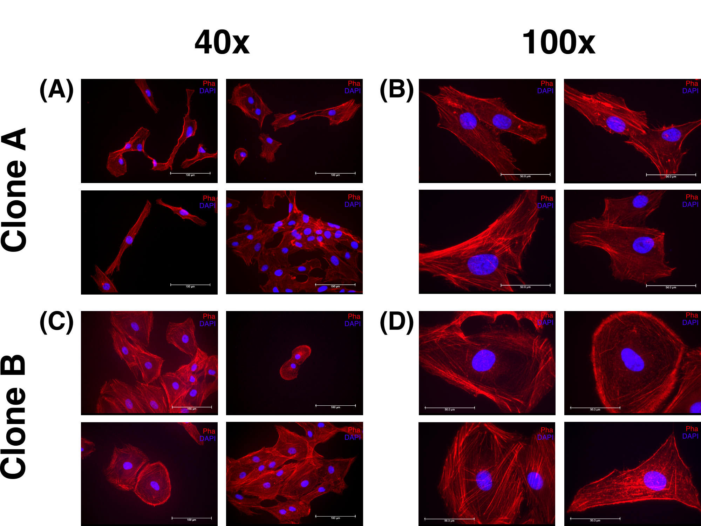
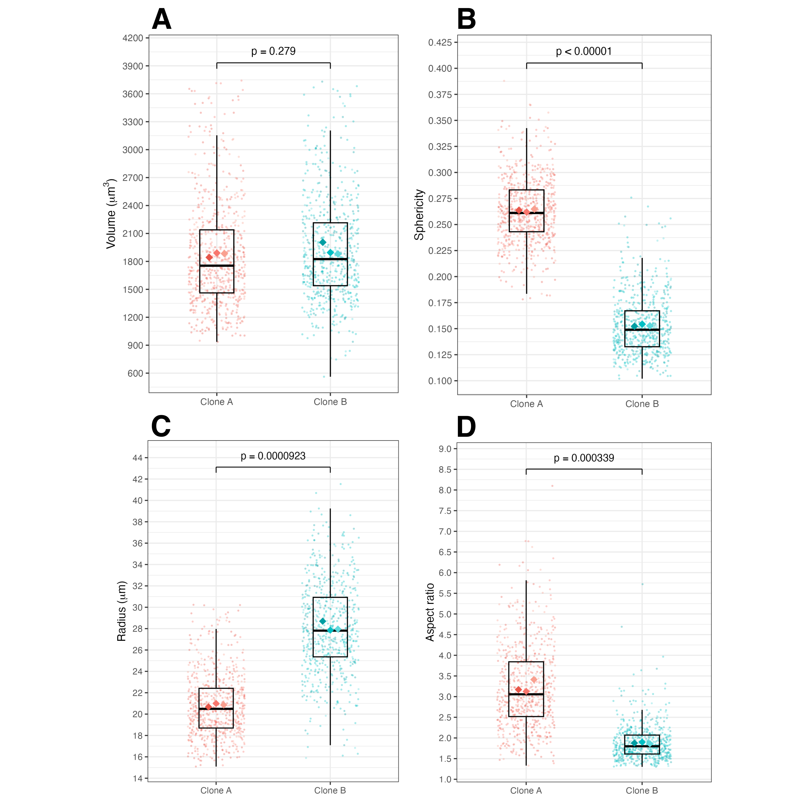
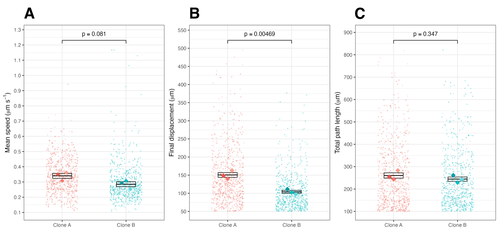
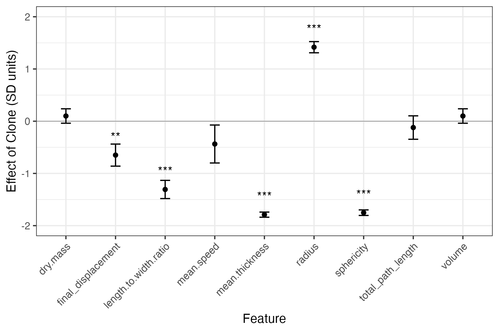
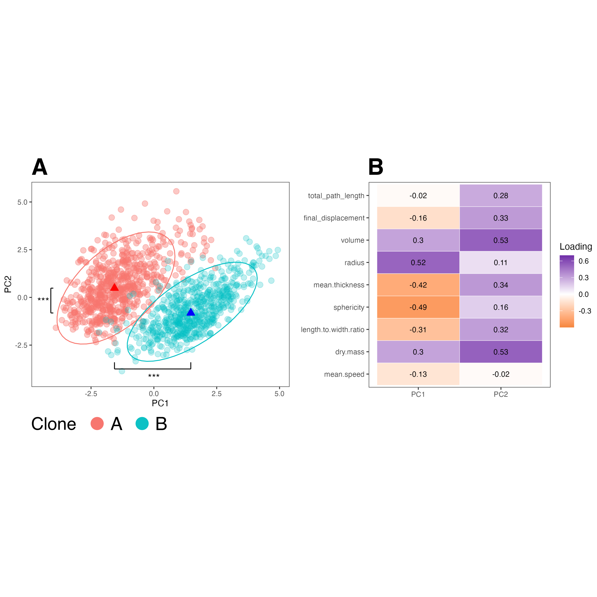
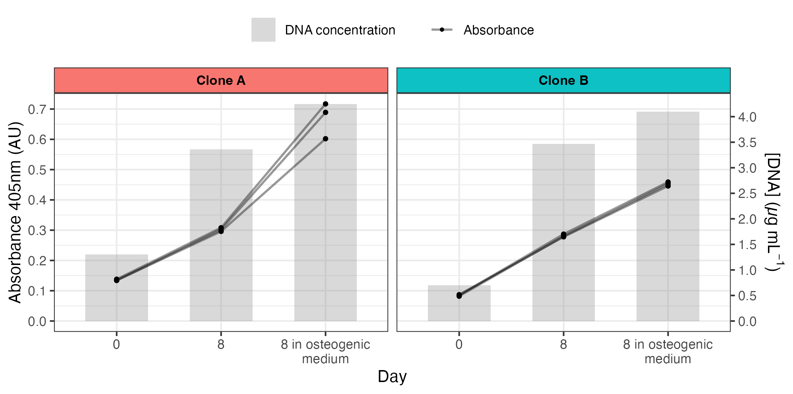

```{r setup, include=FALSE}
knitr::opts_chunk$set(echo = FALSE)
library(lme4)
library(tidyverse)
library(lmerTest)
library(MuMIn)
library(kableExtra)
```

# Abstract

# Introduction

# Approach

# Results

## Cell morphology

hMSC morphology was examined through Livecyte ptychographic quantitative phase imaging, allowing for the analysis of 9 cell morphology parameters. Fluorescence microscopy was used to capture the diverse cytoskeletal morphologies of clones A and B (Figure 1). At 40x magnification, clone A cells displayed a smaller, elongated, spindle-like morphology (Figure 1A), while clone B cells showed a larger, more cobblestone-like morphology (Figure 1C). At 100x magnification, clone A exhibited parallel F-actin fibres aligned along the long axis of the cell (Figure 1B), while clone B showed a more radially-organised F-actin architecture (Figure 1D). Both clones exhibited intact nuclear morphology, as indicated by DAPI staining, suggesting that the cells were healthy and viable.

```{r figure1, out.width = "75%", fig.pos = "H", fig.cap = "\\textbf{Immunofluorescence microscopy shows heterogenous actin filament architecture of clone A and clone B hMSCs.} \\newline Immunofluorescence imaging at 40x and 100x magnification. Alexa-594-conjugated phalloidin (red, F-actin) and DAPI (blue, nuclear dsDNA). Scale bars: 100 $\\mu$m (40x), 50 $\\mu$m (100x)."}

```

The differences in cell morphology are reflected in Figure 2, which shows the quantitative and statistical analysis of cell volume, sphericity, radius, and aspect ratio (Figure 2A, B, C, and D, respectively). Thickness and sphericity were directly correlated ($\rho$ = 1), so only sphericity is reported; likewise with dry mass and volume. No significant difference in cell volume was discovered between clone A and clone B (median 1754.03 $\mu$m$^{3}$ vs 1824.57 $\mu$m$^{3}$, $p$ = 0.275), however clone A had a significantly higher sphericity (median 0.26 vs 0.15, $p$ < $2.2*10^{-16}$) and aspect ratio (median 3.06 vs 1.8, $p$ = 0.000286) than clone B. Clone A also had a significantly smaller radius than clone B (20.49 $\mu$m vs 27.81 $\mu$m, $p$ = 0.0000693), which is consistent with the cobblestone morphology of clone B observed in the fluorescence images. Although clone A appeared more spindle-like in Figure 1, its higher sphericity indicates a more compact three-dimensional profile: clone A cells were taller and narrower, whereas clone B cells were flatter and more spread across the substrate. These findings suggest that both clones of hMSC have distinct morphological properties.

```{r figure2, out.width = "75%", fig.pos = "H", fig.cap = "\\textbf{Morphological characterisation of clone A and clone B} \\newline Column scatter plots showing the distribution of (A) cell volume ($\\mu$m$^{3}$), (B) sphericity, (C) radius ($\\mu$), and (D) aspect ratio of clone A and clone B. Individual points represent single cells. Diamonds indicate replicate means. Box plots show gross distribution: horizontal black bar shows $50^{th}$ percentile; box extends from the $25^{th}$ to the $75^{th}$ percentile, denoting interquartile range (IQR); whiskers extend Q±1.5$*IQR$. Statistical comparisons performed using a linear mixed model, with clone as a fixed effect and replicate as a random effect, with Benjamini-Hochberg correction. $n_A$ = 664, $n_B$ = 612 across 3 technical replicates. ns = non-significant, * $p$ < 0.05, ** $p$ < 0.01, *** $p$ < 0.001, **** $p$ < 0.0001. Full summary statistics provided in Table 1."}

```


\newpage

## Cell motility

Cell motility was assessed through automated Livecyte tracking, with an image taken every 23 minutes for a total of 4 days. This allowed for the analysis of several movement parameters, including mean cell speed (Figure 3A), final displacement (Figure 3B), and total path length (Figure 3C). No significant difference in mean cell speed (median 0.33 $\mu$m min$^{-1}$ vs 0.27 $\mu$m min$^{-1}$, $p$ = 0.0807) or total path length (220 $\mu$m vs 199 $\mu$m, $p$ = 0.347) was found, however clone A had a significantly higher final displacement (130 $\mu$m vs 91 $\mu$m, $p$ = 0.00837); this indicates that clone A cells migrated in a more directionally persistent manner, whereas clone B cells exhibited more meandering, non-directional movement. This is supported by the cell movement plot (Figure 3D), which shows that the tracks of clone A cells were less clustered and extended further from the origin. MSD analysis (Figure 3E) showed that both clones exhibited super-diffusive behaviour on a log-log scale across all time lags ($\tau$, from 1.5 to 96h in ~92-minute increments), with clone A having a higher $\alpha$ value than clone B (1.28 vs 1.17); this indicates that clone A cells had more persistent movement, consistent with the higher final displacement observed. These findings suggest that while mean cell speed and total path length were similar between the clones, clone A cells exhibited more directional and persistent movement compared to clone B cells.

```{r figure3, out.width = "75%", fig.pos = "H", fig.cap = "\\textbf{Motility characterisation of clone A and clone B} \\newline Column scatter plots showing the distribution of (A) mean speed ($\\mu$m min$^{-1}$), (B) final displacement ($\\mu$m), and (C) total path length ($\\mu$m) of clone A and clone B. Individual data points represent single cells. Diamonds indicate replicate means. Box plots overlay gross distribution: horizontal black bar shows 50$^{th}$ percentile (median), box extends from the 25$^{th}$ to the 75$^{th}$ percentile, denoting interquartile range (IQR). Whiskers extend Q±1.5$*IQR$. Statistical comparisons performed using a linear mixed model, with clone as a fixed effect and replicate as a random effect, with Benjamini-Hochberg correction. (D) Cell movement plot of each clone, starting points normalised to the origin; grey points show final cell position; n = 50 for each clone. (E) Mean Squared Displacement as a function of time interval ($\\tau$, from 1.5 to 96h in ~92-minute increments); lines represent the clone average, shaded regions show ±1$*SE$. ns = non-significant, * $p$ < 0.05, ** $p$ < 0.01, *** $p$ < 0.001, **** $p$ < 0.0001. Full summary statistics provided in Table 1."}

```

## Multivariate analysis

### Linear mixed model

To assess how the morphokinetic features collected from the Livecyte microscope were different between clone A and clone B, a linear mixed model (LMMM) was fitted for each feature, with clone as a fixed effect and replicate nested within clone as a random effect. The results of these models are summarised in Table 1. A forest plot of the LMM estimates (Figure 4) showed that the largest effects of clone were on final displacement, aspect ratio, mean thickness, radius, and sphericity, all of which were statistically significant after Benjamini-Hochberg correction (p < 0.01). Volume, dry mass, mean speed, and total path length did not differ significantly between clones. This is reflected in the low Marginal R$^2$ values for these parameters, which represents the proportion of variance explained by the fixed effect of clone. Intraclass correlation coefficients were low across all features (ICC < 0.05), suggesting that inter-replicate variability was low compared to inter-clone variability; this indicates that the observed differences are likely to be reproducible across technical replicates.

```{r figure4, out.width = "75%", fig.pos = "H", fig.cap = "\\textbf{Linear mixed model forest plot of 9 morphokinetic features} \\newline Points represent LMM estimates of the effect of clone (clone A vs clone B) on each feature, expressed in SD units. Error bars show 95% Wald confidence intervals. A positive estimate indicates that clone A has a higher value of the feature than clone B, and vice versa. ns = non-significant, * $p$ < 0.05, ** $p$ < 0.01, *** $p$ < 0.001, **** $p$ < 0.0001. Full summary statistics provided in Table 1."}

```

```{r table1_code, include=FALSE}
source("project/scripts/3.linear_mixed_models.R")
```

```{r table1, echo=FALSE}
knitr::kable(report_table, 
             caption = "Statistical summary of clone A and B morphokinetic features",
             booktabs = TRUE) |>
  kable_styling(font_size = 9, 
                latex_options = c("hold_position", "scale_down")) |>
  footnote(general = c(
    "Estimates are from linear mixed models with clone as a fixed effect and replicate nested within clone as a random effect, expressed in SD units.",
    "95\\\\% CI: Wald confidence interval. Degrees of Freedom: Satterthwaite denominator degrees of freedom.",
    "P-values are Benjamini-Hochberg adjusted",
    "ICC: Intraclass Correlation Coefficient for replicate. R²m: Marginal R².",
    "Where p was calculated to be 0, it is reported as the R precision limit of 2.2e-16"
  ))
```

### Principal Component Analysis

Principal component analysis was performed on the nine standardised features to visualise the multivariate separation between clones (Figure 5). PC1 and PC2 together explained 63% of the total variance. PC1 was most strongly associated with morphological features, such as volume, radius, thickness, and sphericity, while PC2 was more broadly associated with both morphological and motility features, such as volume, dry mass, total path length, and final displacement (Figure 5B). The PCA plot (Figure 5A) showed that the two clones form distinct clusters in the PC1-PC2 space, with PC1 being the primary separator, indicating that the morphological differences between the clones are a major source of variance in the data, and that these differences are statistically sufficient to separate the clones in a multivariate space ($\Delta$ PC1 and $\Delta$ PC2: p < 0.0001). These overall findings suggest that the morphokinetic properties of the cells are generally distinct between the two clones, and that these properties may be useful for predicting hMSC differentiation potential.

```{r figure5, out.width = "75%", fig.pos = "H", fig.cap = "\\textbf{Principle Component Analysis reveals that clone A and clone B form statistically distinct clusters} \\newline (A) PCA score plot of PC2 on PC1 for clone A (red) and clone B (blue). Each point represents a single cell; triangles represent clone centroids. Ellipses show 95% confidence regions. Both PC1 and PC2 scores differed significantly between clones (**** $p$ < 0.0001, Wilcoxon Signed-Rank Test). (B) Loadings heatmap of 9 morphokinetic parameters. n$_A$ = 664, n$_B$ = 612 across 3 technical replicates. Full summary statistics are provided in Table 2."}

```

### Osteogenic differentiation


```{r figure6, out.width = "75%", fig.pos = "H", fig.cap = "\\textbf{Alkaline phosphatase activity of clone A and clone B differed during osteogenic differentiation.} \\newline (Left y-axis; grey lines) Alkaline phosphatase activity measured via absorbance at 405nm (AU). Each line represents a technical replicate (n = 3). (Right y-axis; grey bars) Mean cell number measured via DNA concentration ($\\mu$g ml$^{-1}$). Measurements were taken at day 0, day 8 without osteogenic medium, and day 8 in osteogenic medium. "}

```